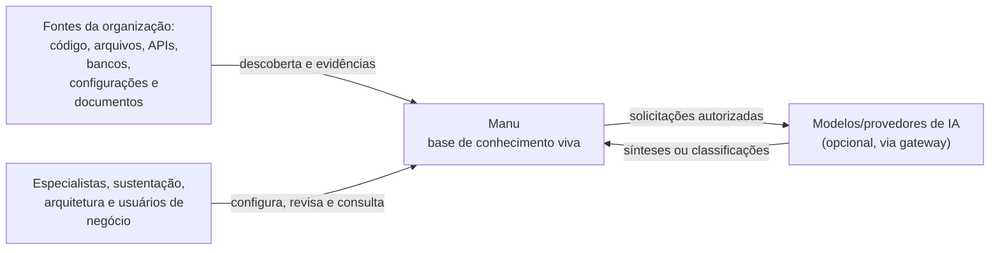
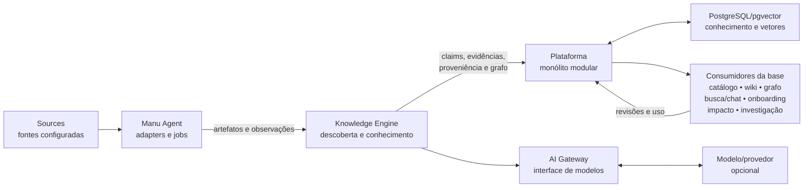

# Arquitetura do Manu

> **Estado:** visão arquitetural inicial, orientada ao MVP. Este documento
> descreve fronteiras, invariantes e fluxos conceituais; não é um desenho de
> tabelas, pacotes, APIs ou infraestrutura definitiva.

## Propósito e contexto

O Manu transforma fontes técnicas e documentais em uma base de conhecimento
viva. O `Knowledge Engine` é o núcleo dessa transformação. Catálogo,
documentação/wiki, grafo, busca, chat, onboarding, análise de impacto e
orientação de investigação são consumidores da base, e não produtos
independentes do núcleo.

As fontes são de primeira classe: código, arquivos, APIs, bancos de dados,
configurações e documentos existentes podem fornecer evidências para o mesmo
conhecimento. O recorte inicial deve demonstrar descoberta sobre duas a quatro
aplicações reais, relações sustentadas por evidências, páginas geradas e
editáveis e revisão por especialista. Integrações com tickets, logs, métricas
e traces não são necessárias para esse recorte.

### Restrições atuais

- A solução deve poder ser executada como uma instalação em Docker Compose em
  uma VPS, sem exigir um serviço de cloud específico.
- O MVP começa com uma `Organization` por instalação. A fronteira lógica da
  organização existe mesmo nesse modo reduzido.
- O armazenamento e a busca vetorial iniciais podem usar PostgreSQL/pgvector;
  isso é uma escolha de implementação inicial, não um contrato para o modelo
  físico do domínio.
- O acesso a modelos passa por um `AI Gateway`, que evita acoplar o núcleo a
  um provedor ou modelo específico.
- SaaS compartilhado operacional, `Control Plane`, integração com chamados e
  ingestão de dados operacionais ficam fora do MVP.

As restrições acima limitam o trabalho presente. Uma afirmação que seja uma
escolha vigente, uma hipótese ou uma opção futura deve permanecer identificada
como tal; ver [a política de ADRs](docs/decisions/README.md) para decisões que
precisem de registro próprio.

### Decisão aceita: fundação Go-first e módulo inicial

O `Manu Agent`, a CLI, o pipeline comum do `Knowledge Engine` e o backend
inicial usam Go como runtime principal. O módulo único tem o caminho canônico
`github.com/pedrogpaulino/manu`, com o layout inicial em `cmd/manu`, `internal`
e `testdata`; não há `pkg` nem workspace multi-módulo nesta fundação. A
composição usa dependências explícitas na raiz do processo e não adota um
container de DI enquanto o grafo permanecer pequeno.

O `go.mod` usa `go 1.25` como versão mínima da linguagem, ainda suportada em
17/08/2026, e `toolchain go1.26.6` como toolchain local validado. A política
acompanha os patches da linha estável suportada após testes e benchmark e
repete a linha de base e a verificação de vulnerabilidades ao mudar de versão
principal. A distribuição futura poderá fixar esse toolchain em uma imagem,
mas isso não transforma uma imagem ou um Compose completo em implementação
presente.

Go é a escolha principal do runtime, não uma exigência para todos os
analisadores especializados. Outro runtime só entra atrás de um protocolo
externo versionado, em mudança própria e após medições demonstrarem que o
benefício semântico compensa os custos de empacotamento, isolamento e
operação. A decisão e seus trade-offs estão no
[ADR 0002 — Fundação Go-first](docs/decisions/0002-fundacao-go-first.md).

## Visão C4 simplificada

A visão abaixo usa C4 apenas para tornar os limites compreensíveis. Os nomes
representam responsabilidades conceituais, não exigem que cada item seja um
processo ou serviço separado.

### Nível de contexto



| Elemento | Tipo C4 | Responsabilidade e relação |
| --- | --- | --- |
| Especialistas, sustentação, arquitetura e usuários de negócio | Pessoas | Configuram fontes, consultam conhecimento e revisam ou enriquecem conteúdo conforme suas permissões. |
| Fontes da organização | Sistema externo | Fornecem os artefatos que serão descobertos e as evidências que sustentam claims. Podem ser repositórios, filesystem, APIs, bancos, configurações ou documentos. |
| Manu | Sistema em escopo | Coordena descoberta, transformação, curadoria e publicação de uma base de conhecimento viva para uma `Organization`. |
| Modelos/provedores de IA | Sistema externo opcional | Podem apoiar síntese ou classificação quando a política da instalação, da fonte e do usuário permitir. O núcleo não depende de um fornecedor específico. |

### Nível de contêineres conceituais



| Contêiner | Papel no desenho inicial |
| --- | --- |
| `Manu Agent` | Executa conectores, descoberta e jobs sobre as fontes autorizadas. Devolve artefatos e resultados de análise ao núcleo sem assumir a função de fonte de verdade. |
| `Knowledge Engine` | Recebe artefatos, faz parsing e correlação, produz observações, claims, evidências, proveniência e o `System Graph`, e coordena a transformação em conhecimento publicável. |
| `Plataforma` | Monólito modular que oferece a superfície da aplicação, autenticação/autorização, políticas, revisão, publicação e os consumidores da base. Os módulos não mudam o fato de que o `Knowledge Engine` é o núcleo. |
| `AI Gateway` | Porta de saída para modelos. Normaliza solicitações e respostas, aplica as políticas relevantes e permite trocar modelo, provedor ou execução local sem espalhar essa dependência pelo engine. |
| `PostgreSQL/pgvector` | Armazenamento inicial para conhecimento e busca vetorial. O detalhe físico pode evoluir atrás de uma fronteira de persistência; não define o vocabulário do domínio. |
| Consumidores da base | Catálogo, wiki, grafo, busca, chat, onboarding, análise de impacto e investigação leem conhecimento já produzido e devolvem sinais de uso ou pedidos de revisão. |

As setas não implicam que toda análise precise de IA, que cada consumidor tenha
um banco próprio ou que os contêineres sejam implantados separadamente. Essas
decisões pertencem a designs de implementação futuros.

## Fluxo do conhecimento

O fluxo conceitual mantém suporte verificável e autoria separados da síntese:

1. **Descoberta:** o `Manu Agent` acessa uma `Source` configurada dentro das
   políticas aplicáveis e identifica `Artifact`s concretos: arquivos, símbolos,
   endpoints, tabelas, configurações, páginas ou outros itens existentes.
2. **Parsing e normalização:** analisadores extraem estrutura e texto sem
   transformar uma interpretação em fato. O resultado é registrado como uma ou
   mais `Observation`s associadas ao artefato, ao método e ao instante.
3. **Correlação:** observações de fontes e execuções diferentes são
   relacionadas por entidades e relações canônicas. O resultado alimenta o
   `System Graph`, preservando as observações que deram origem à relação.
4. **Claims e evidências:** o engine pode formar um `Knowledge Claim` a partir
   de observações. Cada claim mantém as `Evidence`s que o sustentam ou o
   contestam e a `Provenance` (origem, método, tempo e transformação). Claims
   incompatíveis permanecem distinguíveis; não se produz falsa certeza por
   escolher silenciosamente uma fonte.
5. **Geração documental:** com base nos claims e evidências disponíveis, o
   engine pode gerar uma página, trecho de catálogo ou explicação. Conteúdo
   gerado deve apontar para o suporte que pode ser inspecionado.
6. **Revisão e curadoria:** um especialista autorizado revisa, corrige,
   complementa ou rejeita a proposta. Uma `Review` registra a decisão e uma
   `Curation` identifica a contribuição humana, sem apagar a proveniência da
   análise que a motivou.
7. **Publicação e consumo:** após a revisão exigida pela política, o conteúdo
   publicável torna-se disponível aos consumidores autorizados: wiki/catálogo,
   grafo, busca, chat, onboarding, impacto ou investigação.

```text
descoberta → parsing → observações → correlação/System Graph
     → claims + evidências + proveniência → geração documental
     → revisão/curadoria → publicação → uso pelos consumidores
```

Uma nova execução volta ao fluxo pelo artefato e pela observação. Ela compara
o conhecimento existente e pode indicar que uma página está desatualizada ou
que há conflito, preservando o estado anterior para revisão.

## Primeiro corte vertical: pipeline comum

O primeiro corte transforma o fluxo conceitual em um experimento comparável,
sem criar um engine separado para cada linguagem ou tipo de fonte. O pipeline
comum é:

```text
Source autorizada
  → descoberta e Analysis Snapshot
  → fallback genérico + analisadores especializados compostos
  → observações, relações, evidências, cobertura e lacunas
  → projeções relacional, textual e vetorial reconstruíveis
  → recuperação híbrida
  → pacote limitado de evidências autorizado
  → AI Gateway
  → resposta gerada, citações e abstinência
```

### Descoberta, fallback e composição de analisadores

1. **Registro e descoberta:** a fonte é registrada com sua autorização,
   `Source Revision` ou hash verificável, e o recorte recebe um
   `Analysis Snapshot`. A descoberta identifica os `Artifact`s e seu contexto;
   não copia bases externas para este repositório nem concede ao modelo acesso
   direto ao diretório analisado.
2. **Fallback genérico:** toda fonte textual autorizada recebe ao menos o
   inventário genérico aplicável, incluindo tipo, localização, identidade,
   hash e extração textual quando possível. O fallback permanece útil para
   consulta e recuperação, mas declara como não suportadas as dimensões que
   dependeriam de uma especialização ausente.
3. **Analisadores especializados compostos:** analisadores de linguagem,
   framework, pacote, configuração ou documento podem observar os mesmos
   artefatos e acrescentar semântica, relações e `Possible Flow`s. Suas
   contribuições são aditivas no contrato comum: método, evidência,
   `Analysis Coverage` e `Explicit Gap`s permanecem distinguíveis, e uma
   contribuição nova não sobrescreve silenciosamente uma observação anterior.
   O corte pode aprofundar Java/Quarkus e manter cobertura declarativa para
   WSO2 e inventário para Python/Frappe sem prometer a mesma profundidade.

O resultado factual e sua proveniência são preservados antes de qualquer
projeção. A arquitetura não cria um modelo físico independente por analisador;
um único fluxo correlaciona as contribuições e mantém resultados parciais
utilizáveis quando uma dimensão falha.

### Projeções e recuperação híbrida

O conhecimento comum pode ser projetado em três visões recuperáveis:

- **relacional:** entidades, relações, identificadores e metadados para
  consultas estruturadas e expansão de relações diretas;
- **textual:** unidades semanticamente delimitadas, localização e metadados
  para correspondência de termos e citações;
- **vetorial:** embeddings ligados ao conteúdo, à revisão e à proveniência que
  os originaram para busca por similaridade.

Essas projeções são reconstruíveis e não são a fonte de verdade. A recuperação
híbrida combina termos exatos, similaridade semântica e relações sustentadas,
ordena os sinais de modo reproduzível e limita o orçamento de contexto. Se
embeddings estiverem indisponíveis, proibidos ou incompletos, inventário,
conteúdo textual, relações e evidências já produzidos continuam utilizáveis;
a limitação da recuperação semântica permanece visível.

### Pacote de evidências e resposta assistida

Uma consulta valida primeiro `Organization`, usuário, `Source` e a política
de transferência. Só então monta um pacote limitado com trechos, entidades,
relações, localizações, `Evidence`, `Provenance`, cobertura e lacunas
autorizadas. O pacote é a única entrada da etapa de resposta; o modelo não
consulta a fonte diretamente nem pode contornar as permissões do índice.

O `AI Gateway` mantém portas conceituais separadas para embeddings e geração.
Para o experimento inicial, a OpenAI API é o adaptador externo autorizado,
substituível atrás dessa fronteira; identificadores de modelo, parâmetros,
tokens, custo estimado, latência e estado pertencem ao registro da execução,
não ao contrato do domínio. A credencial é fornecida externamente ao processo
e nunca deve aparecer em manifesto, documento, saída, log ou fixture.

Quando autorizada, a resposta é `Generated knowledge`, referencia as
evidências usadas, separa observações de inferências e declara lacunas. Se o
pacote não sustentar uma conclusão, a resposta deve limitar ou recusar a
conclusão em vez de usar conhecimento geral do modelo como evidência da
organização. Se a IA estiver indisponível ou proibida, somente as etapas
dependentes dela ficam limitadas; os resultados não dependentes continuam
disponíveis conforme as políticas já descritas.

### Superfície operacional inicial por CLI

A superfície inicial é uma CLI, escolhida como o caminho operacional mais
curto para o experimento e para automação. Suas intenções conceituais são:

```text
source register   registrar uma fonte e suas políticas
analyze           criar um Analysis Snapshot
status            consultar progresso, cobertura, falhas e lacunas
ask               recuperar evidências e solicitar uma resposta
evidence          inspecionar o suporte de uma resposta ou relação
eval              executar perguntas de competência
benchmark         medir ingestão, consulta, recursos e custo
```

Os nomes finais podem evoluir na implementação, mas cada operação deve ter
uma saída legível por pessoa e uma representação estruturada para automação.
Falha parcial, ausência de IA e abstinência devem ser estados distinguíveis
de uma falha técnica total.

## Fronteira de benchmark e escolha posterior de stack

Esta mudança define a fronteira de medição, não uma escolha definitiva de
linguagem, biblioteca, persistência, protocolo ou mecanismo de ingestão. Uma
decisão posterior de stack deve executar o mesmo microcorte comparável sobre o
manifesto e o corpus identificados, preservando suas revisões ou hashes.

O benchmark deve medir, no mínimo:

- descoberta, hashing e atualização de arquivos;
- parsing representativo de Java, XML/WSO2 e Python/texto;
- transformação para o resultado mínimo comum e suas evidências;
- leitura e escrita em lote pela fronteira de persistência;
- concorrência limitada, duração, pico de memória e volume persistido;
- operação local compatível com o futuro modo Compose;
- primeira análise, repetição sem mudança e atualização localizada;
- latência, tokens e custo externo quando a IA for usada.

As medições registram ambiente, configuração e limitações e servem como linha
de base experimental, não como SLA ou promessa comercial. O adaptador OpenAI
do experimento não fixa o provedor de produção, e uma projeção inicial como
PostgreSQL/pgvector não transforma a fronteira do benchmark em modelo físico
obrigatório. A escolha posterior deve considerar conjuntamente desempenho,
consumo, maturidade e segurança das bibliotecas e velocidade de evolução,
usando operações e corpus reais do corte.

## Contrato universal de compreensão

Cada analisador é especializado na semântica da `Source` que conhece. Essa
especialização não cria um contrato isolado: o resultado de cada analisador
deve poder contribuir para um contrato conceitual universal de compreensão,
que permite correlacionar fontes diferentes sem nivelar artificialmente a
profundidade alcançada.

```text
Source
  │
  ▼
analisador especializado ──► resultado + cobertura + lacunas
                                      │
                                      ▼
                         contrato universal de compreensão
                                      │
                                      ▼
                 correlação ──► base de conhecimento viva
```

O contrato organiza significado e suporte, e não escolhe protocolo,
serialização, estrutura de dados, mecanismo de persistência ou stack. Suas
dimensões iniciais são:

1. inventário, paisagem e estrutura;
2. entidades e relações;
3. fluxos e dependências;
4. decisões, condições e origens dos dados usados;
5. variações por configuração, ambiente e feature flag;
6. capacidades disponíveis e como acessá-las;
7. erros, sua criação, propagação e caminhos possíveis;
8. evolução entre revisões, releases, configurações e implantações;
9. correspondência e divergência documental;
10. evidências, proveniência, incerteza e lacunas.

Uma `Source` pode contribuir somente para parte dessas dimensões. A
correlação projeta contribuições compatíveis nos conceitos comuns, mas
preserva a `Source`, o método, o contexto e o suporte de cada contribuição.
Uma relação ou síntese não ganha uma certeza maior apenas por ser correlacionada
com outra fonte.

Os fluxos devem manter as qualificações `Possible Flow`, `Observed Execution` e
`Business Process`. Uma capacidade oferecida pelo ambiente é uma `Capability`,
enquanto uma página, mapa, explicação ou relatório produzido pelo Manu é um
`Knowledge Product`; ambos permanecem relacionados sem serem confundidos. Cada
resultado expõe sua `Analysis Coverage` e suas `Explicit Gap`s.

### Cobertura parcial e explícita

Cada análise deve declarar o escopo e as dimensões tentados, bem como o
resultado da cobertura em cada dimensão: produzido, incompleto, não suportado,
não aplicável ou com falha. A existência de um analisador para um tipo de
fonte não é um selo de compreensão completa, nem implica profundidade uniforme
entre fontes ou execuções.

Quando uma dimensão falhar, as demais contribuições sustentadas continuam
utilizáveis. A falha parcial e as lacunas ficam visíveis para a correlação e
para as experiências que apresentam o conhecimento. Novas dimensões ou
detalhes especializados podem ser adicionados depois, desde que mantenham uma
projeção compreensível para o contrato universal.

## Contexto para comparações qualificadas

Conhecimento que depende de versão ou ambiente deve manter os contextos que a
análise realmente conhece, sem condensá-los em um campo genérico de “versão”.
Os vínculos podem estar ausentes ou ser desconhecidos; essa ausência é parte
do resultado e não deve ser preenchida por inferência.

| Contexto | Papel na comparação |
| --- | --- |
| `Source Revision` | Revisão da `Source` que foi observada, quando identificável. |
| `Analysis Snapshot` | Recorte, instante e método da análise que produziu as observações. |
| `Environment` | Ambiente ao qual uma configuração, documentação ou implantação se aplica, quando conhecido. |
| `Release` | Release ou marco de evolução ao qual os artefatos e a documentação se referem, quando disponível. |
| `Build Artifact` | Artefato de build relacionado a uma revisão de fonte, se essa relação puder ser sustentada. |
| `Deployment` | Implantação que relaciona um artefato de build a um ambiente, quando houver evidência do vínculo. |
| `Configuration State` | Configurações e variações ativas no escopo analisado, incluindo flags quando aplicável. |
| `Documentation Revision` | Revisão da documentação usada ou comparada com a fonte, análise ou ambiente. |

Uma comparação deve primeiro declarar quais desses contextos estão presentes,
quais não estão disponíveis e quais relações são sustentadas. Só depois deve
explicar uma diferença, preservando a evidência de cada lado. Assim, código
igual com `Configuration State` diferente deve ser apresentado como diferença
de configuração; uma `Source Revision` sem vínculo conhecido com `Build
Artifact` ou `Deployment` não autoriza afirmar que o código analisado é o que
está implantado; e uma `Documentation Revision` anterior à fonte analisada
deve ser sinalizada como possível desatualização ou necessidade de revisão.

Vínculo com uma implantação também não transforma, por si só, um caminho
reconstruído em ocorrência observada. Comparações e explicações devem manter
separadas a origem, o suporte, a temporalidade e o contexto comportamental,
declarando a lacuna quando não houver evidência suficiente.

## Preservação de conteúdo curado

Conteúdo curado é uma contribuição humana, não um cache descartável da última
análise. Quando uma nova observação divergir de uma página, claim ou relação
curada:

- a revisão ou contribuição humana permanece preservada e identificável;
- a nova evidência, seu tempo e sua proveniência são anexados como material
  comparável;
- o conteúdo pode ser marcado como `stale`/desatualizado ou como conflito, com
  a razão e as fontes visíveis;
- o sistema propõe uma nova revisão ou atualização ao especialista autorizado;
- a publicação somente muda após a política de revisão aplicável ser satisfeita.

Uma análise nunca sobrescreve silenciosamente uma correção, explicação ou
decisão curada. Mesmo quando o especialista aceita a nova informação, a
revisão mantém o histórico e a relação entre o conteúdo anterior e o novo.

## `Organization` como fronteira transversal

`Organization` é a fronteira de conhecimento, políticas e autorização de uma
empresa cliente. A arquitetura deve carregar essa associação através de todas
as superfícies relevantes, sem decidir agora se o isolamento físico será por
banco, schema, namespace, célula ou outra técnica.

| Área | Escopo conceitual da organização |
| --- | --- |
| Dados e documentos | Artefatos, observações, claims, páginas, revisões e arquivos pertencem a uma organização. |
| Busca e grafo | Índices, embeddings, relações e resultados são consultados no escopo autorizado da organização. |
| Jobs e `Manu Agent`s | Execuções, filas, conectores e credenciais são atribuídos à organização; um job não deve atravessar essa fronteira por padrão. |
| Segredos | Credenciais de fontes, modelos e integrações são segredos da organização e seguem a política da instalação correspondente. |
| Agents | Configuração, instruções, ferramentas e histórico de cada Agent são vinculados à organização e às permissões que o usam. |
| Políticas e IA | Políticas de tratamento de conteúdo e solicitações ao `AI Gateway` são avaliadas no escopo da organização. |
| Auditoria | Ações de leitura, processamento, transferência, revisão, publicação e alteração de política têm ator, organização, tempo e resultado auditáveis. |

Esse vínculo é uma garantia lógica e de autorização, não uma promessa sobre o
modelo físico. O isolamento físico definitivo será escolhido apenas quando
existirem requisitos operacionais suficientes.

## Arquitetura celular e modos de implantação

Uma **célula** é uma unidade operável da plataforma que contém aplicação,
jobs, dados, busca, segredos, Agents, políticas e auditoria de um escopo de
organizações. A célula reduz o raio de falha e oferece uma unidade de
provisionamento sem obrigar o MVP a ter um plano de controle.

```text
                   modos possíveis
 ┌────────────────────┬─────────────────────┬────────────────────┐
 │ SaaS compartilhado │ SaaS dedicado       │ Self-hosted        │
 │ várias orgs em uma │ uma célula por org, │ uma célula por org, │
 │ célula, isoladas   │ operada pelo Manu   │ operada no cliente  │
 └────────────────────┴─────────────────────┴────────────────────┘
                              ▲
                              │ recorte inicial
                    uma Organization por instalação
                         Docker Compose / VPS
```

- **SaaS compartilhado — opção futura:** várias `Organization`s podem ocupar
  uma célula compartilhada, com isolamento lógico, políticas e auditoria por
  organização. Operar esse modo, incluindo seus controles de capacidade e
  atualização, não faz parte do MVP.
- **SaaS dedicado — opção disponível no destino:** o Manu opera uma célula
  dedicada para uma organização, por exemplo em uma VPS. No recorte inicial,
  essa é uma instalação de uma organização.
- **Self-hosted — opção disponível no destino:** a mesma célula é executada no
  ambiente do cliente, sob a operação e as políticas de sua organização.

O **recorte inicial aceito** é uma `Organization` por instalação em Docker
Compose/VPS, seja uma VPS operada pelo Manu ou pelo cliente. Isso não elimina a
fronteira organizacional: dados, documentos, busca, jobs, segredos, Agents,
políticas, IA e auditoria continuam conceitualmente escopados.

Um `Control Plane` é uma **opção futura** para provisionar, licenciar e
atualizar células. Ele não deve precisar acessar o conhecimento do cliente, e
sua implementação não pertence ao MVP.

## Políticas de conteúdo e autorização

Tratamento de conteúdo sensível depende de três controles independentes. Eles
são políticas e permissões auditáveis, não `feature flags`.

| Controle | Pergunta que responde | Exemplos de decisão |
| --- | --- | --- |
| Política da instalação | O que esta instalação pode processar ou transferir para fora de seu ambiente? | Permitir apenas modelos locais; bloquear envio de conteúdo completo; restringir regiões ou destinos de transferência. |
| Política da fonte | Que parte e que tipo de conteúdo desta `Source` pode ser processada? | Permitir metadados, trechos ou conteúdo completo; exigir redação de segredos; limitar analisadores ou retenção. |
| Permissão do usuário | Este usuário pode realizar o processamento solicitado e visualizar o resultado ou a evidência? | Autorizar configuração de uma fonte, leitura de uma página, acesso a trecho sensível ou publicação de uma revisão. |

Os controles se combinam, mas não se substituem. Uma permissão de usuário não
libera uma transferência proibida pela instalação; uma política de fonte não
concede visualização a quem não tem autorização. O pipeline deve avaliar os
controles antes do processamento, antes da transferência pelo `AI Gateway` e
antes de exibir conteúdo ou evidência. Quando uma etapa não é permitida, o
resultado deve indicar a ausência ou o redaction aplicável em vez de inventar
suporte.

### Acesso à fonte e transferência para IA são autorizações independentes

Autorizar o `Knowledge Engine` a acessar e analisar uma `Source` não autoriza,
por si só, transferir seu conteúdo para um modelo ou provedor externo. A
decisão de transferência deve ser avaliada separadamente pelas políticas da
instalação, da fonte e do usuário, inclusive quando a análise da fonte já foi
permitida.

Essa regra é a mesma nos modos **SaaS dedicado** e **self-hosted**: os dois
devem aplicar as mesmas políticas conceituais de instalação, fonte e usuário,
sem depender de um mecanismo físico específico de conexão. Se a análise dentro
da célula for permitida, mas a transferência externa for proibida, o engine
continua produzindo o conhecimento que não depende de IA e bloqueia somente as
etapas que exigem essa transferência. A limitação deve permanecer visível
para as experiências e não ser preenchida por uma inferência do modelo.

Quando a IA estiver indisponível, não configurada ou proibida, continuam
disponíveis os resultados não dependentes de IA, como inventário, estrutura,
relações, evidências, `Possible Flow`s e conhecimento curado já autorizado.
Sínteses ou explicações que dependeriam de IA podem ficar limitadas ou
indisponíveis, sem retirar a proveniência nem ampliar o acesso ao conteúdo
original. Uma saída de IA, quando autorizada, permanece conhecimento gerado e
não substitui evidência técnica.

## Portabilidade e independência de modelo

O desenho mantém portas conceituais entre fontes, `Knowledge Engine`,
persistência, plataforma e `AI Gateway`:

- nenhuma cloud é obrigatória; Docker Compose/VPS é suficiente para a forma
  inicial;
- nenhum provedor ou modelo de IA é obrigatório. Um adaptador pode apontar para
  um serviço externo permitido ou para execução local, sujeito às políticas;
- PostgreSQL/pgvector é a infraestrutura inicial considerada, mas o domínio
  não depende de tabelas, extensões ou vetores como conceitos públicos;
- fontes e consumidores são conectados por contratos conceituais, permitindo
  trocar conectores, analisadores, modelos e mecanismos de busca sem mudar a
  narrativa do conhecimento;
- nada fora do MVP — tickets, logs, métricas, traces, diagnóstico automático,
  SaaS compartilhado operacional ou `Control Plane` — é pré-requisito para
  produzir e revisar conhecimento a partir de fontes documentais.

Essa portabilidade é uma restrição de arquitetura, não uma promessa de
suportar todos os adaptadores desde o primeiro incremento.

## Invariantes e opções em aberto

### Decisões e invariantes aceitos nesta fundação

- O `Knowledge Engine` e a base de conhecimento viva são o centro; os
  consumidores não redefinem o produto.
- Evidência, proveniência, temporalidade, estado de revisão e autoria humana
  acompanham claims e conteúdo curado.
- Nova análise propõe atualização, desatualização ou conflito; não substitui
  curadoria silenciosamente.
- `Organization` é uma fronteira transversal obrigatória, inclusive na
  instalação de uma única organização.
- As políticas de instalação, fonte e usuário permanecem separadas.
- Analisadores especializados contribuem para um contrato universal de
  compreensão, com cobertura parcial explícita — produzida, incompleta, não
  suportada, não aplicável ou com falha — sem promessa de profundidade
  uniforme entre fontes.
- A IA pode apoiar síntese, explicação, classificação ou consulta quando
  autorizada, mas sua saída não é evidência técnica autossuficiente e não é
  condição para a disponibilidade de resultados não dependentes dela.
- A forma inicial é uma célula de uma organização em Docker Compose/VPS e o
  desenho não exige cloud ou fornecedor de IA.

Esses invariantes são aceitos como parte da fundação documental. Uma decisão
de implementação que seja difícil de reverter e dependa de trade-offs
específicos deve ser registrada como ADR segundo
[docs/decisions/README.md](docs/decisions/README.md). O contrato universal de
compreensão está registrado no [ADR 0001 — Contrato universal de compreensão](docs/decisions/0001-contrato-universal-de-compreensao.md);
decisões posteriores sobre mecanismos físicos ou operacionais devem seguir a
mesma política.

### Hipóteses a validar

- Um monólito modular atende ao volume e ao ritmo do MVP sem separar os
  contêineres em serviços independentes.
- A revisão por especialista é suficiente para manter a base útil e confiável
  nas duas a quatro aplicações reais do primeiro fluxo vertical.
- A combinação de busca textual, vetorial e relações do `System Graph` atende
  aos primeiros consumidores sem um mecanismo adicional.

### Opções futuras, sem compromisso de entrega

- células de SaaS compartilhado operacional e um `Control Plane`;
- isolamento físico ou estratégia de persistência específica para cada modo;
- conectores de tickets e ingestão de logs, métricas e traces;
- diagnóstico automático de causa raiz e outros analisadores operacionais;
- novos provedores, modelos ou serviços gerenciados quando uma política e um
  requisito concreto justificarem a escolha.

Não se deve tratar esta lista como roadmap. Uma opção só se torna trabalho
quando uma mudança OpenSpec a delimitar e justificar.
