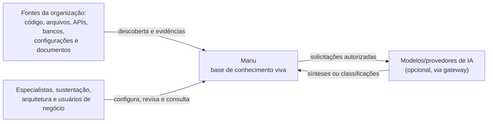
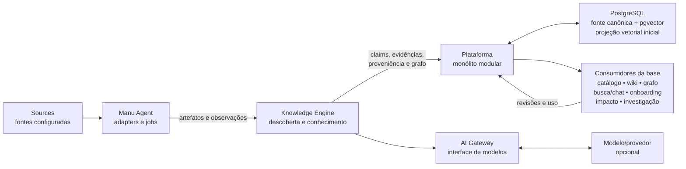

# Arquitetura do Manu

> **Estado:** visão arquitetural orientada ao MVP, com o estado do corte local
> identificado ao longo do texto. Este documento descreve fronteiras,
> invariantes e fluxos; não é um desenho de produção, de tabelas definitivo ou
> de implantação SaaS. A API, as migrações PostgreSQL/pgvector, a persistência
> e os clientes CLI já possuem contratos executáveis locais. A integração do
> Agent com o bundle estendido e a composição do executor de ingestão no
> processo servidor foram verificadas na célula local Linux; o registro está em
> [`docs/verification/10-3-local-cell.md`](docs/verification/10-3-local-cell.md).
> Nada aqui apresenta autenticação, UI, daemon remoto, IA local, SaaS ou
> operação de produção como capacidade disponível.

## Propósito e contexto

O Manu transforma fontes técnicas e documentais em uma base de conhecimento
viva. O `Knowledge Engine` é o núcleo dessa transformação. Catálogo,
documentação/wiki, grafo, busca, chat, onboarding, análise de impacto e
orientação de investigação são consumidores da base, e não produtos
independentes do núcleo.

As fontes são de primeira classe: código, arquivos, APIs, bancos de dados,
configurações e documentos existentes podem fornecer evidências para o mesmo
conhecimento. O recorte inicial deve demonstrar descoberta sobre duas a quatro
aplicações reais, relações sustentadas por evidências, páginas geradas e
editáveis e revisão por especialista. Integrações com tickets, logs, métricas
e traces não são necessárias para esse recorte.

### Restrições atuais

- A forma inicial deve poder ser executada como uma célula Docker Compose
  local, sem exigir um serviço de cloud específico. VPS e self-hosted são
  modos de implantação a validar posteriormente.
- O MVP começa com uma `Organization` por instalação. A fronteira lógica da
  organização existe mesmo nesse modo reduzido.
- A decisão aceita para a persistência operacional do primeiro corte é usar
  PostgreSQL como fonte de verdade; pgvector é somente a projeção vetorial
  inicial reconstruível. A implementação local fornece migrações e composição
  do banco, mas isso não é um contrato para o modelo físico definitivo nem uma
  capacidade de produção.
- O acesso a modelos, quando autorizado e implementado, passa por um `AI
  Gateway` com portas independentes de embedding e geração e adaptadores
  explícitos, sem transformar `OpenAI-compatible` em contrato de domínio.
- SaaS compartilhado operacional, `Control Plane`, integração com chamados e
  ingestão de dados operacionais ficam fora do MVP.

### Estado executável do corte local

O Agent determinístico continua independente da plataforma: `manu analyze`,
`manu inspect` e `manu benchmark` leem a fonte autorizada sem banco ou IA. A
plataforma local acrescenta `manu migrate` e `manu serve`, com os clientes
`manu ingest`, `manu ingestion`, `manu ask` e `manu evidence`. A API documentada
em [`docs/openapi.json`](docs/openapi.json) expõe ingestões, consultas,
evidências, liveness e readiness.

O fluxo executável é `Agent → Analysis Bundle → API → PostgreSQL/projeções →
consulta`. O formato `legacy` (`v1alpha1`) continua sendo o padrão de
`manu analyze`; para a plataforma, `--output-mode bundle
--organization-id <id>` produz diretamente o bundle estendido exigido por
`manu ingest`. O modo bundle remove a raiz local da fonte do envelope portátil
e inclui as sequências canônicas disponíveis. O staging, a persistência antes
do `202` e a recuperação do executor após reinício foram exercitados na
verificação 10.3, sem transformar essa célula em uma instalação de produção.

Não existe comando público para reconstruir projeções. As projeções são
derivadas dos fatos canônicos; a troca de perfil de embedding requer uma
reconstrução explícita em mudança operacional própria. A ausência de um
comando não autoriza apagar o volume ou editar tabelas manualmente.

As restrições acima limitam o trabalho presente. Uma afirmação que seja uma
escolha vigente, uma hipótese ou uma opção futura deve permanecer identificada
como tal; ver [a política de ADRs](docs/decisions/README.md) para decisões que
precisem de registro próprio.

### Decisão aceita: fundação Go-first e módulo inicial

O `Manu Agent`, a CLI, o pipeline comum do `Knowledge Engine` e o backend
inicial usam Go como runtime principal. O módulo único tem o caminho canônico
`github.com/pedrogpaulino/manu`, com o layout inicial em `cmd/manu`, `internal`
e `testdata`; não há `pkg` nem workspace multi-módulo nesta fundação. A
composição usa dependências explícitas na raiz do processo e não adota um
container de DI enquanto o grafo permanecer pequeno.

O `go.mod` usa `go 1.25` como versão mínima da linguagem, ainda suportada em
17/08/2026, e `toolchain go1.26.6` como toolchain local validado. A política
acompanha os patches da linha estável suportada após testes e benchmark e
repete a linha de base e a verificação de vulnerabilidades ao mudar de versão
principal. A distribuição futura poderá fixar esse toolchain em uma imagem,
mas isso não transforma uma imagem ou um Compose completo em implementação
presente.

Go é a escolha principal do runtime, não uma exigência para todos os
analisadores especializados. Outro runtime só entra atrás de um protocolo
externo versionado, em mudança própria e após medições demonstrarem que o
benefício semântico compensa os custos de empacotamento, isolamento e
operação. A decisão e seus trade-offs estão no
[ADR 0002 — Fundação Go-first](docs/decisions/0002-fundacao-go-first.md).

### Decisão aceita: PostgreSQL como fonte de verdade e pgvector como projeção

Para o primeiro corte consultável, PostgreSQL é a fonte de verdade operacional
da representação canônica de uma `Organization`: fontes, snapshots, artefatos,
observações, entidades, relações, evidências, cobertura, lacunas, falhas e
estado das operações. Snapshots são imutáveis e o histórico permanece
consultável quando a visão ativa muda.

pgvector é somente a projeção vetorial inicial. Projeções textuais,
relacionais e vetoriais podem ser removidas e reconstruídas a partir dos fatos
canônicos autorizados; embeddings não são conhecimento nem evidência. A
alteração de um perfil de embedding exige uma nova projeção e não pode misturar
vetores incompatíveis. O Agent continua produzindo bundles localmente, sem
conexão direta com o banco ou dependência de IA.

Essa decisão fixa uma fronteira operacional para o primeiro vertical slice,
não um modelo físico definitivo nem uma implantação de produção. O porquê e
os trade-offs estão no
[ADR 0003 — PostgreSQL e pgvector](docs/decisions/0003-postgresql-fonte-de-verdade-pgvector-projecao.md).

### Decisão aceita: `AI Gateway` independente de provedor

O `AI Gateway` expõe duas portas internas independentes: `Embedder`, para
embeddings, e `Generator`, para geração baseada em um pacote autorizado de
evidências. DTOs de provedor não atravessam essas portas; uso, latência,
modelo efetivo e erros são normalizados sem apagar metadados de auditoria.

O primeiro corte prevê adaptadores explícitos para a API nativa da OpenAI e
para um protocolo `OpenAI-compatible` configurado, inicialmente validado com
OpenRouter. Compatibilidade de transporte não é contrato do domínio: as
capacidades devem ser declaradas e validadas, sem fallback silencioso. Cada
capacidade tem configuração, credencial, prazo e orçamento próprios; trocar o
gerador não exige reindexação, enquanto trocar o embedding exige rebuild.

Essa fronteira aceita a portabilidade como regra de arquitetura. Os
adaptadores e a configuração local existem, mas chamadas externas são opt-in,
o modo simulado é o padrão e não há autenticação, IA local ou suporte de
produção. A decisão e seus trade-offs estão no
[ADR 0004 — AI Gateway](docs/decisions/0004-ai-gateway-independente-de-provedor.md).

### Decisão aceita: kernel factual e frontends substituíveis

O pipeline adota um kernel factual técnico entre as contribuições de frontend
e as projeções de consulta. A contribuição bruta, a normalização sustentada,
os fatos observados, a derivação com linhagem e a recuperação são estágios
distintos. Frontends declaram capacidades, limitações, versões e perfil de
execução; suas contribuições são aditivas e permanecem distinguíveis por
produtor, método, evidência e cobertura.

O `Analysis Bundle` é a fronteira de intercâmbio versionada para contribuições
locais ou importadas. O perfil `safe-static` é o padrão do Agent; compiladores
ou indexadores externos só podem atuar em `semantic-isolated`, e índices
produzidos previamente entram por `imported-index`, sempre com validação de
escopo, locadores, produtor, versão e limites. Tree-sitter, SCIP e Joern
continuam opções externas sem dependência obrigatória, conforme a
[comparação registrada](docs/verification/1-5-frontend-comparison.md).

O porquê, os trade-offs, a derivação determinística e a não promoção de
dependências opcionais estão no
[ADR 0005 — Kernel factual, frontends substituíveis e intercâmbio](docs/decisions/0005-kernel-factual-frontends-substituiveis-e-intercambio.md).

## Visão C4 simplificada

A visão abaixo usa C4 apenas para tornar os limites compreensíveis. Os nomes
representam responsabilidades conceituais, não exigem que cada item seja um
processo ou serviço separado.

### Nível de contexto



| Elemento | Tipo C4 | Responsabilidade e relação |
| --- | --- | --- |
| Especialistas, sustentação, arquitetura e usuários de negócio | Pessoas | Configuram fontes, consultam conhecimento e revisam ou enriquecem conteúdo conforme suas permissões. |
| Fontes da organização | Sistema externo | Fornecem os artefatos que serão descobertos e as evidências que sustentam claims. Podem ser repositórios, filesystem, APIs, bancos, configurações ou documentos. |
| Manu | Sistema em escopo | Coordena descoberta, transformação, curadoria e publicação de uma base de conhecimento viva para uma `Organization`. |
| Modelos/provedores de IA | Sistema externo opcional | Podem apoiar síntese ou classificação quando a política da instalação, da fonte e do usuário permitir. O núcleo não depende de um fornecedor específico. |

### Nível de contêineres conceituais



| Contêiner | Papel no desenho inicial |
| --- | --- |
| `Manu Agent` | Executa descoberta e análises sobre as fontes autorizadas. Devolve artefatos e resultados em destino local; o Agent não assume a função de fonte de verdade nem abre conexão direta com o banco. |
| `Knowledge Engine` | Recebe contribuições de frontends, normaliza fatos sustentados, preserva evidências e cobertura, deriva relações com linhagem, atualiza projeções e coordena a transformação em conhecimento publicável e `Context Package`s. |
| `Plataforma` | Monólito modular que já oferece, no corte local, migrações, API versionada, persistência canônica, projeções e clientes CLI. O modo servidor sem autenticação fica restrito a uma `Organization` e loopback; revisão, publicação editorial e consumidores de produto ainda não são superfícies implementadas. |
| `AI Gateway` | Fronteira de saída com portas independentes `Embedder` e `Generator` e adaptadores explícitos. Normaliza solicitações e respostas sem espalhar tipos de provedor pelo engine; o modo simulado não usa rede e chamadas externas exigem política, configuração e orçamento. |
| `PostgreSQL/pgvector` | PostgreSQL é a fonte de verdade operacional do primeiro corte local; pgvector é a projeção vetorial inicial reconstruível. O detalhe físico pode evoluir atrás dessa fronteira e não define o vocabulário do domínio. |
| Consumidores da base | Catálogo, wiki, grafo, busca, chat, onboarding, análise de impacto, investigação e consumidores de contexto leem conhecimento já produzido e devolvem sinais de uso ou pedidos de revisão. MCP, quando habilitado, é apenas um adaptador de leitura dessa porta. |

As setas não implicam que toda análise precise de IA, que cada consumidor tenha
um banco próprio ou que os contêineres sejam implantados separadamente. Essas
decisões pertencem a designs de implementação futuros.

## Fluxo do conhecimento

O fluxo conceitual mantém suporte verificável e autoria separados da síntese:

1. **Descoberta:** o `Manu Agent` acessa uma `Source` configurada dentro das
   políticas aplicáveis e identifica `Artifact`s concretos: arquivos, símbolos,
   endpoints, tabelas, configurações, páginas ou outros itens existentes.
2. **Parsing e normalização:** analisadores extraem estrutura e texto sem
   transformar uma interpretação em fato. O resultado é registrado como uma ou
   mais `Observation`s associadas ao artefato, ao método e ao instante.
3. **Correlação:** observações de fontes e execuções diferentes são
   relacionadas por entidades e relações canônicas. O resultado alimenta o
   `System Graph`, preservando as observações que deram origem à relação.
4. **Claims e evidências:** o engine pode formar um `Knowledge Claim` a partir
   de observações. Cada claim mantém as `Evidence`s que o sustentam ou o
   contestam e a `Provenance` (origem, método, tempo e transformação). Claims
   incompatíveis permanecem distinguíveis; não se produz falsa certeza por
   escolher silenciosamente uma fonte.
5. **Geração documental:** com base nos claims e evidências disponíveis, o
   engine pode gerar uma página, trecho de catálogo ou explicação. Conteúdo
   gerado deve apontar para o suporte que pode ser inspecionado.
6. **Revisão e curadoria:** um especialista autorizado revisa, corrige,
   complementa ou rejeita a proposta. Uma `Review` registra a decisão e uma
   `Curation` identifica a contribuição humana, sem apagar a proveniência da
   análise que a motivou.
7. **Publicação e consumo:** após a revisão exigida pela política, o conteúdo
   publicável torna-se disponível aos consumidores autorizados: wiki/catálogo,
   grafo, busca, chat, onboarding, impacto ou investigação.

```text
descoberta → parsing → observações → correlação/System Graph
     → claims + evidências + proveniência → geração documental
     → revisão/curadoria → publicação → uso pelos consumidores
```

Uma nova execução volta ao fluxo pelo artefato e pela observação. Ela compara
o conhecimento existente e pode indicar que uma página está desatualizada ou
que há conflito, preservando o estado anterior para revisão.

## Primeiro corte vertical: pipeline comum

O primeiro corte transforma o fluxo conceitual em um experimento comparável,
sem criar um engine separado para cada linguagem ou tipo de fonte. O pipeline
comum é:

```text
Source autorizada
  → descoberta e Analysis Snapshot
  → contribuições de fallback e frontends especializados
  → normalização factual sustentada
  → fatos observados + evidências, cobertura e lacunas
  → derivação versionada com linhagem
  → projeções relacional, textual e vetorial reconstruíveis
  → solicitação escopada + recuperação híbrida
  → Context Package limitado e autorizado
  → consumidores: pessoas, API, MCP ou AI Gateway
```

No protocolo executável local, o bundle estendido é um diretório versionado
com `manifest.json`, `artifacts.ndjson`, `contributions.ndjson` e,
quando disponível, `evidence.ndjson`. O cliente `manu ingest` transmite essas
partes para `POST /api/v1/ingestions`; ele não envia a raiz da fonte, um
repositório remoto ou um arquivo compactado. A API limita o corpo e cada
sequência, valida digest, contagens, referências e a `Organization`, cria um
job idempotente e expõe o estado por `GET /api/v1/ingestions/{id}`. O executor
deve persistir o canônico antes de materializar projeções e ativar o snapshot.

O comando público `manu analyze --output-mode bundle --organization-id <id>` é
a forma suportada de produzir esse bundle; não existe uma conversão separada a
executar. O modo legado permanece disponível como padrão para compatibilidade.
O executor no `manu serve` consome o staging durável e recupera jobs pendentes
conforme o registro operacional citado acima.

### Estágios factuais e derivação

Os estágios abaixo são responsabilidades separadas, mesmo quando executados no
mesmo processo:

1. **Contribuição:** um frontend produz observações, extensões, evidências,
   cobertura e lacunas para um `Analysis Snapshot`, identificando produtor,
   método e versão. A contribuição não é ainda uma afirmação universal.
2. **Normalização:** um normalizador projeta somente predicados, participantes
   e qualificadores sustentados no kernel factual. Detalhes sem equivalente
   seguro continuam em extensões versionadas, sem conversão silenciosa.
3. **Fato observado:** a identidade técnica inclui organização, fonte,
   snapshot, conteúdo factual, produtor, qualificadores e evidências. Fatos de
   produtores diferentes permanecem distinguíveis; uma nova contribuição não
   apaga a anterior nem resolve conflito sem regra ou curadoria.
4. **Derivação:** regras monotônicas versionadas recebem fatos ordenados,
   produzem relações adicionais até um ponto fixo ou limite e registram cada
   fato de entrada e a versão da regra. Limites de iteração, fatos e fanout
   produzem lacuna controlada quando atingidos.
5. **Atualização:** hashes, versões de frontend, schema e regra determinam o
   que pode ser reutilizado. Fatos alterados e o fanout reverso das derivações
   são reprocessados; o resultado incremental deve poder ser comparado ao
   rebuild completo sem alterar fatos observados.

### Descoberta, fallback e composição de analisadores

1. **Registro e descoberta:** a fonte é registrada com sua autorização,
   `Source Revision` ou hash verificável, e o recorte recebe um
   `Analysis Snapshot`. A descoberta identifica os `Artifact`s e seu contexto;
   não copia bases externas para este repositório nem concede ao modelo acesso
   direto ao diretório analisado.
2. **Contribuição genérica:** toda fonte textual autorizada recebe ao menos o
   inventário genérico aplicável, incluindo tipo, localização, identidade,
   hash e extração textual quando possível. O fallback permanece útil para
   consulta e recuperação, mas declara como não suportadas as dimensões que
   dependeriam de uma especialização ausente.
3. **Analisadores especializados compostos:** analisadores de linguagem,
   framework, pacote, configuração ou documento podem observar os mesmos
   artefatos e acrescentar semântica, relações e `Possible Flow`s. Suas
   contribuições são aditivas no contrato comum: método, evidência,
   `Analysis Coverage` e `Explicit Gap`s permanecem distinguíveis, e uma
   contribuição nova não sobrescreve silenciosamente uma observação anterior.
   O corte pode aprofundar Java/Quarkus e manter cobertura declarativa para
   WSO2 e inventário para Python/Frappe sem prometer a mesma profundidade.

O resultado factual e sua proveniência devem ser preservados em PostgreSQL
antes de qualquer projeção. A arquitetura não cria um modelo físico
independente por analisador; um único fluxo correlaciona as contribuições e
mantém resultados parciais utilizáveis quando uma dimensão falha.

### Perfis de frontend e intercâmbio

Cada frontend publica um manifesto com família, versões reconhecidas,
predicados possíveis, capacidades, limitações, produtor, método e perfil de
execução. O manifesto é uma declaração de cobertura, não uma prova de que
todos os predicados foram produzidos no snapshot.

- `safe-static` é o perfil padrão: parsing e extração local, sem rede, build,
  instalação ou execução da fonte. Ele deve continuar executável sem banco e
  sem IA e compatível com os builds estáticos do Agent.
- `semantic-isolated` é um perfil opcional para compiladores ou indexadores
  externos. O processo, o filesystem, a rede, o tempo, a memória e o volume
  exportado devem ser limitados e o resultado deve retornar pelo intercâmbio
  validado.
- `imported-index` recebe um índice produzido previamente. A ingestão valida
  schema, versão, organização, fonte, snapshot, locadores, produtor, limites
  e extensões antes de aceitar qualquer contribuição, sem executar a
  ferramenta que o produziu.

O `Analysis Bundle` mantém o envelope existente e acrescenta manifestos,
fatos e extensões de modo aditivo. Não há ABI de plugin Go obrigatória. Um
formato externo como SCIP pode ser aceito como entrada validada, mas não se
torna o contrato semântico da base; um parser ou CPG externo também não pode
substituir o kernel factual. A decisão e a comparação dos candidatos estão no
[ADR 0005](docs/decisions/0005-kernel-factual-frontends-substituiveis-e-intercambio.md)
e no [registro de verificação 1.5](docs/verification/1-5-frontend-comparison.md).

### Projeções e recuperação híbrida

O conhecimento comum pode ser projetado em três visões recuperáveis:

- **relacional:** entidades, relações, identificadores e metadados para
  consultas estruturadas e expansão de relações diretas;
- **textual:** unidades semanticamente delimitadas, localização e metadados
  para correspondência de termos e citações;
- **vetorial:** embeddings ligados ao conteúdo, à revisão e à proveniência que
  os originaram para busca por similaridade.

Essas projeções são reconstruíveis e não são a fonte de verdade: PostgreSQL
preserva os fatos canônicos e pgvector materializa somente a visão vetorial
inicial. A recuperação híbrida combina termos exatos, similaridade semântica e
relações sustentadas, ordena os sinais de modo reproduzível e limita o
orçamento de contexto. A solicitação informa `Organization`, `Source`,
`Analysis Snapshot`, intenção e limites positivos; escopo ausente, ambíguo ou
não autorizado é rejeitado antes da recuperação. O compositor prioriza
relevância, cobertura, diversidade e suporte relacional sob limites de tokens,
itens, caracteres e bytes, com algoritmo, ordenação e desempate versionados.
Se embeddings estiverem indisponíveis, proibidos ou incompletos, inventário,
conteúdo textual, relações e evidências já produzidos continuam utilizáveis; a
limitação da recuperação semântica permanece visível.

No corte atual não existe uma subcomanda de rebuild nem uma operação de
reindexação pública. A reconstrução é uma responsabilidade do pipeline e das
interfaces internas de projeção, partindo dos fatos canônicos e das unidades de
evidência autorizadas. Um perfil de embedding é imutável: trocar provedor,
modelo, dimensão ou normalização cria uma projeção incompatível, que deve ser
reconstruída sem misturar vetores nem alterar a proveniência original.

### Pacote de evidências e resposta assistida

Uma consulta deverá validar primeiro a `Organization` configurada, a `Source`
e as políticas de instalação e conteúdo aplicáveis. No modo sem autenticação
previsto para este corte, o escopo será uma única `Organization` em loopback;
isso não substitui uma futura autenticação/autorização. Só então monta um
`Context Package` limitado com identidade e revisão do pacote, intenção,
entidades, relações ou caminhos possíveis, itens de contexto, locadores,
`Evidence`, `Provenance`, cobertura, lacunas, degradações, estimativa de tokens
e continuação quando aplicável. O pacote distingue conhecimento observado,
gerado e curado; fatos e relações derivados tecnicamente permanecem ligados à
sua linhagem e não criam um estado epistemológico adicional. O pacote não
apresenta relação sem o suporte obrigatório. O
`AI Gateway` recebe somente uma projeção sanitizada desse pacote; o modelo não
consulta a fonte diretamente nem pode contornar as permissões do índice.

O `AI Gateway` mantém portas independentes para embeddings e geração. Os
adaptadores explícitos da API nativa da OpenAI e do protocolo
`OpenAI-compatible` (validado inicialmente com OpenRouter) ficam atrás dessa
fronteira; nenhum DTO ou protocolo de fornecedor se torna contrato do domínio,
e diferenças de capacidade devem ser declaradas. Identificadores de modelo,
parâmetros, tokens, custo estimado, latência e estado pertencem ao registro da
execução. Credenciais são fornecidas externamente ao processo e nunca devem
aparecer em manifesto, documento, saída, log ou fixture.

Quando autorizada, a resposta é `Generated knowledge`, referencia as
evidências usadas, separa observações de inferências e declara lacunas. Se o
pacote não sustentar uma conclusão, a resposta deve limitar ou recusar a
conclusão em vez de usar conhecimento geral do modelo como evidência da
organização. Se a IA estiver indisponível ou proibida, somente as etapas
dependentes dela ficam limitadas; os resultados não dependentes continuam
disponíveis conforme as políticas já descritas.

### Fronteira MCP somente leitura

O `manu mcp` previsto para esta mudança é um adaptador local por `stdio`, sem
transporte remoto, sobre a mesma porta de aplicação que produz o `Context
Package`. Ele anuncia, em ordem determinística, somente as operações
`manu_query`, `manu_context`, `manu_impact` e `manu_evidence`. Tipos e schemas
do protocolo ficam na borda; nenhuma chamada MCP acessa PostgreSQL, SQL,
Cypher, o filesystem da `Source` ou ferramentas de mutação diretamente.

Antes de cada recuperação e inspeção, o adaptador resolve e revalida
`Organization`, `Source`, snapshot, permissões e política de transferência.
Orçamento, redaction, degradação, continuação e auditoria são aplicados por
item; erros não revelam conteúdo negado, credenciais, detalhes internos ou
recursos fora do escopo. Uma referência histórica permanece ligada ao snapshot
solicitado, mesmo quando existe uma revisão posterior.

Essa superfície é uma forma de consumo derivada e não está presente no corte
executável atual enquanto as tarefas de implementação MCP não forem
concluídas. O `Context Package` continua útil sem `Generator` e sem cliente
MCP; nenhuma dessas superfícies substitui o `Knowledge Engine`.

### Superfície operacional inicial por CLI

A superfície inicial combina o Agent e clientes locais da API:

```text
version           mostrar a versão do binário
analyze           analisar uma raiz local; legacy por padrão ou bundle estendido
                  com --output-mode bundle --organization-id
inspect           inspecionar resultado, cobertura, lacunas e falhas
benchmark         medir análise inicial, repetição e atualização localizada
migrate           aplicar migrações PostgreSQL embarcadas
serve             iniciar a API local
ingest            transmitir um Analysis Bundle estendido
ingestion         consultar o estado de uma ingestão
ask               criar uma consulta versionada
evidence          inspecionar uma Evidence Unit
eval              executar avaliação simulada (live é opt-in)
ready             verificar readiness local do servidor
```

`source register` e `status` são intenções conceituais, não subcomandos
disponíveis neste corte. Cada comando existente oferece saída humana e, quando
aplicável, `--json`; falha parcial, ausência de IA e abstinência são estados
distinguíveis de falha técnica. `ask` exige um `kind` explícito
(`inventory`, `possible_flow`, `observed_execution` ou `business_intent`). Uma
pergunta sobre execução ocorrida não é respondida como fato quando só existe
um caminho estático.

## Fronteira de benchmark e escolha posterior de stack

Esta mudança define a fronteira de medição, não uma escolha definitiva de
linguagem, biblioteca, persistência, protocolo ou mecanismo de ingestão. Uma
decisão posterior de stack deve executar o mesmo microcorte comparável sobre o
manifesto e o corpus identificados, preservando suas revisões ou hashes.

O benchmark deve medir, no mínimo:

- descoberta, hashing e atualização de arquivos;
- parsing representativo de Java, XML/WSO2 e Python/texto;
- transformação para o resultado mínimo comum e suas evidências;
- leitura e escrita em lote pela fronteira de persistência;
- concorrência limitada, duração, pico de memória e volume persistido;
- operação local compatível com o futuro modo Compose;
- primeira análise, repetição sem mudança e atualização localizada;
- latência, tokens e custo externo quando a IA for usada.

As medições registram ambiente, configuração e limitações e servem como linha
de base experimental, não como SLA, promessa comercial ou prova de uma
implantação de produção. PostgreSQL é a fonte de verdade operacional do
primeiro corte e pgvector sua projeção vetorial inicial; isso não transforma a
fronteira do benchmark no modelo físico do domínio. Os adaptadores previstos
para OpenAI e OpenRouter também não são capacidades disponíveis sem
configuração e política explícitas. Qualquer evolução deve considerar
conjuntamente desempenho, consumo, maturidade e segurança das bibliotecas e
velocidade de evolução, usando operações e corpus reais do corte.

## Contrato universal de compreensão

Cada analisador é especializado na semântica da `Source` que conhece. Essa
especialização não cria um contrato isolado: o resultado de cada analisador
deve poder contribuir para um contrato conceitual universal de compreensão,
que permite correlacionar fontes diferentes sem nivelar artificialmente a
profundidade alcançada.

```text
Source
  │
  ▼
analisador especializado ──► resultado + cobertura + lacunas
                                      │
                                      ▼
                         contrato universal de compreensão
                                      │
                                      ▼
                 correlação ──► base de conhecimento viva
```

O contrato organiza significado e suporte, e não escolhe protocolo,
serialização, estrutura de dados, mecanismo de persistência ou stack. Suas
dimensões iniciais são:

1. inventário, paisagem e estrutura;
2. entidades e relações;
3. fluxos e dependências;
4. decisões, condições e origens dos dados usados;
5. variações por configuração, ambiente e feature flag;
6. capacidades disponíveis e como acessá-las;
7. erros, sua criação, propagação e caminhos possíveis;
8. evolução entre revisões, releases, configurações e implantações;
9. correspondência e divergência documental;
10. evidências, proveniência, incerteza e lacunas.

Uma `Source` pode contribuir somente para parte dessas dimensões. A
correlação projeta contribuições compatíveis nos conceitos comuns, mas
preserva a `Source`, o método, o contexto e o suporte de cada contribuição.
Uma relação ou síntese não ganha uma certeza maior apenas por ser correlacionada
com outra fonte.

Os fluxos devem manter as qualificações `Possible Flow`, `Observed Execution` e
`Business Process`. Uma capacidade oferecida pelo ambiente é uma `Capability`,
enquanto uma página, mapa, explicação ou relatório produzido pelo Manu é um
`Knowledge Product`; ambos permanecem relacionados sem serem confundidos. Cada
resultado expõe sua `Analysis Coverage` e suas `Explicit Gap`s.

### Cobertura parcial e explícita

Cada análise deve declarar o escopo e as dimensões tentados, bem como o
resultado da cobertura em cada dimensão: produzido, incompleto, não suportado,
não aplicável ou com falha. A existência de um analisador para um tipo de
fonte não é um selo de compreensão completa, nem implica profundidade uniforme
entre fontes ou execuções.

Quando uma dimensão falhar, as demais contribuições sustentadas continuam
utilizáveis. A falha parcial e as lacunas ficam visíveis para a correlação e
para as experiências que apresentam o conhecimento. Novas dimensões ou
detalhes especializados podem ser adicionados depois, desde que mantenham uma
projeção compreensível para o contrato universal.

## Contexto para comparações qualificadas

Conhecimento que depende de versão ou ambiente deve manter os contextos que a
análise realmente conhece, sem condensá-los em um campo genérico de “versão”.
Os vínculos podem estar ausentes ou ser desconhecidos; essa ausência é parte
do resultado e não deve ser preenchida por inferência.

| Contexto | Papel na comparação |
| --- | --- |
| `Source Revision` | Revisão da `Source` que foi observada, quando identificável. |
| `Analysis Snapshot` | Recorte, instante e método da análise que produziu as observações. |
| `Environment` | Ambiente ao qual uma configuração, documentação ou implantação se aplica, quando conhecido. |
| `Release` | Release ou marco de evolução ao qual os artefatos e a documentação se referem, quando disponível. |
| `Build Artifact` | Artefato de build relacionado a uma revisão de fonte, se essa relação puder ser sustentada. |
| `Deployment` | Implantação que relaciona um artefato de build a um ambiente, quando houver evidência do vínculo. |
| `Configuration State` | Configurações e variações ativas no escopo analisado, incluindo flags quando aplicável. |
| `Documentation Revision` | Revisão da documentação usada ou comparada com a fonte, análise ou ambiente. |

Uma comparação deve primeiro declarar quais desses contextos estão presentes,
quais não estão disponíveis e quais relações são sustentadas. Só depois deve
explicar uma diferença, preservando a evidência de cada lado. Assim, código
igual com `Configuration State` diferente deve ser apresentado como diferença
de configuração; uma `Source Revision` sem vínculo conhecido com `Build
Artifact` ou `Deployment` não autoriza afirmar que o código analisado é o que
está implantado; e uma `Documentation Revision` anterior à fonte analisada
deve ser sinalizada como possível desatualização ou necessidade de revisão.

Vínculo com uma implantação também não transforma, por si só, um caminho
reconstruído em ocorrência observada. Comparações e explicações devem manter
separadas a origem, o suporte, a temporalidade e o contexto comportamental,
declarando a lacuna quando não houver evidência suficiente.

## Preservação de conteúdo curado

Conteúdo curado é uma contribuição humana, não um cache descartável da última
análise. Quando uma nova observação divergir de uma página, claim ou relação
curada:

- a revisão ou contribuição humana permanece preservada e identificável;
- a nova evidência, seu tempo e sua proveniência são anexados como material
  comparável;
- o conteúdo pode ser marcado como `stale`/desatualizado ou como conflito, com
  a razão e as fontes visíveis;
- o sistema propõe uma nova revisão ou atualização ao especialista autorizado;
- a publicação somente muda após a política de revisão aplicável ser satisfeita.

Uma análise nunca sobrescreve silenciosamente uma correção, explicação ou
decisão curada. Mesmo quando o especialista aceita a nova informação, a
revisão mantém o histórico e a relação entre o conteúdo anterior e o novo.

## `Organization` como fronteira transversal

`Organization` é a fronteira de conhecimento, políticas e autorização de uma
empresa cliente. A arquitetura deve carregar essa associação através de todas
as superfícies relevantes, sem decidir agora se o isolamento físico será por
banco, schema, namespace, célula ou outra técnica.

| Área | Escopo conceitual da organização |
| --- | --- |
| Dados e documentos | Artefatos, observações, claims, páginas, revisões e arquivos pertencem a uma organização. |
| Busca e grafo | Índices, embeddings, relações e resultados são consultados no escopo autorizado da organização. |
| Jobs e `Manu Agent`s | Execuções, filas, conectores e credenciais são atribuídos à organização; um job não deve atravessar essa fronteira por padrão. |
| Segredos | Credenciais de fontes, modelos e integrações são segredos da organização e seguem a política da instalação correspondente. |
| Agents | Configuração, instruções, ferramentas e histórico de cada Agent são vinculados à organização e às permissões que o usam. |
| Políticas e IA | Políticas de tratamento de conteúdo e solicitações ao `AI Gateway` são avaliadas no escopo da organização. |
| Auditoria | Ações de leitura, processamento, transferência, revisão, publicação e alteração de política têm ator, organização, tempo e resultado auditáveis. |

Esse vínculo é uma garantia lógica e de autorização, não uma promessa sobre o
modelo físico. O isolamento físico definitivo será escolhido apenas quando
existirem requisitos operacionais suficientes.

## Arquitetura celular e modos de implantação

Uma **célula** é uma unidade operável da plataforma que contém aplicação,
jobs, dados, busca, segredos, Agents, políticas e auditoria de um escopo de
organizações. A célula reduz o raio de falha e oferece uma unidade de
provisionamento sem obrigar o MVP a ter um plano de controle.

```text
                   modos possíveis
 ┌────────────────────┬─────────────────────┬────────────────────┐
 │ SaaS compartilhado │ SaaS dedicado       │ Self-hosted        │
 │ várias orgs em uma │ uma célula por org, │ uma célula por org, │
 │ célula, isoladas   │ operada pelo Manu   │ operada no cliente  │
 └────────────────────┴─────────────────────┴────────────────────┘
                              ▲
                              │ recorte inicial
                    uma Organization por instalação
                         Docker Compose local
```

- **SaaS compartilhado — opção futura:** várias `Organization`s podem ocupar
  uma célula compartilhada, com isolamento lógico, políticas e auditoria por
  organização. Operar esse modo, incluindo seus controles de capacidade e
  atualização, não faz parte do MVP.
- **SaaS dedicado — opção futura de implantação:** o Manu poderá operar uma
  célula dedicada para uma organização, por exemplo em uma VPS. O recorte
  inicial fornece somente a célula local experimental.
- **Self-hosted — modo de destino ainda não validado:** a mesma célula poderá
  ser executada no ambiente do cliente, sob a operação e as políticas de sua
  organização, mas o suporte operacional completo não está implementado.

O **recorte inicial aceito** é uma `Organization` por célula local em Docker
Compose. Uma execução em VPS ou no ambiente de um cliente é uma possibilidade
de implantação a validar, não uma garantia de operação SaaS ou self-hosted.
Isso não elimina a fronteira organizacional: dados, documentos, busca, jobs,
segredos, Agents, políticas, IA e auditoria continuam conceitualmente
escopados.

Um `Control Plane` é uma **opção futura** para provisionar, licenciar e
atualizar células. Ele não deve precisar acessar o conhecimento do cliente, e
sua implementação não pertence ao MVP.

## Políticas de conteúdo e autorização

Tratamento de conteúdo sensível depende de três controles independentes. Eles
são políticas e permissões auditáveis, não `feature flags`.

| Controle | Pergunta que responde | Exemplos de decisão |
| --- | --- | --- |
| Política da instalação | O que esta instalação pode processar ou transferir para fora de seu ambiente? | Permitir apenas modelos locais; bloquear envio de conteúdo completo; restringir regiões ou destinos de transferência. |
| Política da fonte | Que parte e que tipo de conteúdo desta `Source` pode ser processada? | Permitir metadados, trechos ou conteúdo completo; exigir redação de segredos; limitar analisadores ou retenção. |
| Permissão do usuário | Este usuário pode realizar o processamento solicitado e visualizar o resultado ou a evidência? | Autorizar configuração de uma fonte, leitura de uma página, acesso a trecho sensível ou publicação de uma revisão. |

Os controles se combinam, mas não se substituem. Uma permissão de usuário não
libera uma transferência proibida pela instalação; uma política de fonte não
concede visualização a quem não tem autorização. O pipeline deve avaliar os
controles antes do processamento, antes da transferência pelo `AI Gateway` e
antes de exibir conteúdo ou evidência. Quando uma etapa não é permitida, o
resultado deve indicar a ausência ou o redaction aplicável em vez de inventar
suporte.

### Acesso à fonte e transferência para IA são autorizações independentes

Autorizar o `Knowledge Engine` a acessar e analisar uma `Source` não autoriza,
por si só, transferir seu conteúdo para um modelo ou provedor externo. A
decisão de transferência deve ser avaliada separadamente pelas políticas da
instalação, da fonte e do usuário, inclusive quando a análise da fonte já foi
permitida.

Essa regra é a mesma nos modos **SaaS dedicado** e **self-hosted**: os dois
devem aplicar as mesmas políticas conceituais de instalação, fonte e usuário,
sem depender de um mecanismo físico específico de conexão. Se a análise dentro
da célula for permitida, mas a transferência externa for proibida, o engine
continua produzindo o conhecimento que não depende de IA e bloqueia somente as
etapas que exigem essa transferência. A limitação deve permanecer visível
para as experiências e não ser preenchida por uma inferência do modelo.

Quando a IA estiver indisponível, não configurada ou proibida, continuam
disponíveis os resultados não dependentes de IA, como inventário, estrutura,
relações, evidências, `Possible Flow`s e conhecimento curado já autorizado.
Sínteses ou explicações que dependeriam de IA podem ficar limitadas ou
indisponíveis, sem retirar a proveniência nem ampliar o acesso ao conteúdo
original. Uma saída de IA, quando autorizada, permanece conhecimento gerado e
não substitui evidência técnica.

## Portabilidade e independência de modelo

O desenho mantém portas conceituais entre fontes, `Knowledge Engine`,
persistência, plataforma e `AI Gateway`:

- nenhuma cloud é obrigatória; Docker Compose local é suficiente para a forma
  inicial deste corte;
- nenhum provedor ou modelo de IA é contrato obrigatório. Os adaptadores
  explícitos do primeiro corte são opcionais e sujeitos às políticas; execução
  local de IA permanece uma opção futura, não uma capacidade deste corte;
- PostgreSQL/pgvector é a infraestrutura inicial aceita: PostgreSQL preserva a
  fonte de verdade operacional e pgvector materializa a projeção vetorial
  reconstruível, mas o domínio não depende de tabelas, extensões ou vetores
  como conceitos públicos;
- fontes e consumidores são conectados por contratos conceituais, permitindo
  trocar conectores, analisadores, modelos e mecanismos de busca sem mudar a
  narrativa do conhecimento;
- nada fora do MVP — tickets, logs, métricas, traces, diagnóstico automático,
  SaaS compartilhado operacional ou `Control Plane` — é pré-requisito para
  produzir e revisar conhecimento a partir de fontes documentais.

Essa portabilidade é uma restrição de arquitetura, não uma promessa de
suportar todos os adaptadores desde o primeiro incremento.

## Invariantes e opções em aberto

### Decisões e invariantes aceitos nesta fundação

- O `Knowledge Engine` e a base de conhecimento viva são o centro; os
  consumidores não redefinem o produto.
- Evidência, proveniência, temporalidade, estado de revisão e autoria humana
  acompanham claims e conteúdo curado.
- Nova análise propõe atualização, desatualização ou conflito; não substitui
  curadoria silenciosamente.
- `Organization` é uma fronteira transversal obrigatória, inclusive na
  instalação de uma única organização.
- PostgreSQL é a fonte de verdade operacional do primeiro corte e pgvector é
  uma projeção vetorial inicial reconstruível; nenhuma projeção substitui os
  fatos, relações ou evidências canônicos.
- As políticas de instalação, fonte e usuário permanecem separadas.
- Analisadores especializados contribuem para um contrato universal de
  compreensão, com cobertura parcial explícita — produzida, incompleta, não
  suportada, não aplicável ou com falha — sem promessa de profundidade
  uniforme entre fontes.
- A IA pode apoiar síntese, explicação, classificação ou consulta quando
  autorizada, mas sua saída não é evidência técnica autossuficiente e não é
  condição para a disponibilidade de resultados não dependentes dela.
- O `AI Gateway` separa `Embedder` e `Generator`, mantém DTOs de provedor nos
  adaptadores explícitos e não trata `OpenAI-compatible` como contrato de
  domínio.
- O kernel factual separa contribuição, normalização, fatos observados,
  derivação com linhagem e recuperação; fatos derivados identificam regra,
  versão e entradas e não reclassificam fatos de origem.
- Frontends declaram capacidades e limitações, compõem contribuições de forma
  aditiva e usam o `Analysis Bundle` como intercâmbio validado; perfis
  `safe-static`, `semantic-isolated` e `imported-index` mantêm execução e
  importação sob controle explícito.
- O `Context Package` é a representação neutra, limitada e autorizada para
  pessoas, API, MCP e `AI Gateway`; nenhum consumidor acessa a fonte ou a
  persistência diretamente e continua possível consultar sem `Generator`.
- O MCP, quando habilitado, é um adaptador local somente leitura por `stdio`,
  com revalidação de escopo e política em cada chamada; não oferece SQL,
  Cypher, mutação ou transporte remoto nesta fundação.
- A forma inicial é uma célula de uma organização em Docker Compose local e o
  desenho não exige cloud ou fornecedor de IA.

Esses invariantes são aceitos como parte da fundação documental. Uma decisão
de implementação que seja difícil de reverter e dependa de trade-offs
específicos deve ser registrada como ADR segundo
[docs/decisions/README.md](docs/decisions/README.md). O contrato universal de
compreensão está registrado no [ADR 0001 — Contrato universal de compreensão](docs/decisions/0001-contrato-universal-de-compreensao.md);
a persistência e as projeções iniciais estão no [ADR 0003 — PostgreSQL e pgvector](docs/decisions/0003-postgresql-fonte-de-verdade-pgvector-projecao.md),
e o gateway no [ADR 0004 — AI Gateway](docs/decisions/0004-ai-gateway-independente-de-provedor.md). O kernel factual, os frontends e o intercâmbio estão no [ADR 0005](docs/decisions/0005-kernel-factual-frontends-substituiveis-e-intercambio.md).
Decisões posteriores sobre mecanismos físicos ou operacionais devem seguir a
mesma política.

### Hipóteses a validar

- Um monólito modular atende ao volume e ao ritmo do MVP sem separar os
  contêineres em serviços independentes.
- A revisão por especialista é suficiente para manter a base útil e confiável
  nas duas a quatro aplicações reais do primeiro fluxo vertical.
- A combinação de busca textual, vetorial e relações do `System Graph` atende
  aos primeiros consumidores sem um mecanismo adicional.
- A combinação de frontends seguros e eventuais índices importados produzirá
  cobertura suficiente para as perguntas de competência das três famílias;
  Tree-sitter, SCIP e Joern permanecem opções a validar, não dependências do
  núcleo.

### Opções futuras, sem compromisso de entrega

- células de SaaS compartilhado operacional e um `Control Plane`;
- isolamento físico ou estratégia de persistência específica para cada modo;
- conectores de tickets e ingestão de logs, métricas e traces;
- diagnóstico automático de causa raiz e outros analisadores operacionais;
- novos provedores, modelos ou serviços gerenciados quando uma política e um
  requisito concreto justificarem a escolha.

Não se deve tratar esta lista como roadmap. Uma opção só se torna trabalho
quando uma mudança OpenSpec a delimitar e justificar.
