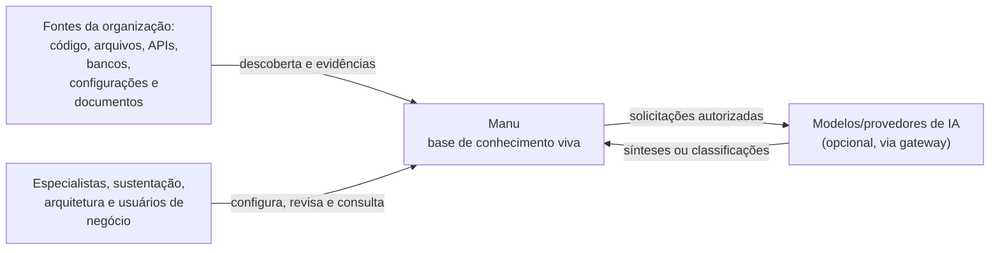
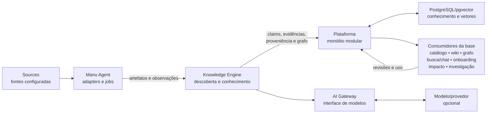

# Arquitetura do Manu

> **Estado:** visão arquitetural inicial, orientada ao MVP. Este documento
> descreve fronteiras, invariantes e fluxos conceituais; não é um desenho de
> tabelas, pacotes, APIs ou infraestrutura definitiva.

## Propósito e contexto

O Manu transforma fontes técnicas e documentais em uma base de conhecimento
viva. O `Knowledge Engine` é o núcleo dessa transformação. Catálogo,
documentação/wiki, grafo, busca, chat, onboarding, análise de impacto e
orientação de investigação são consumidores da base, e não produtos
independentes do núcleo.

As fontes são de primeira classe: código, arquivos, APIs, bancos de dados,
configurações e documentos existentes podem fornecer evidências para o mesmo
conhecimento. O recorte inicial deve demonstrar descoberta sobre duas a quatro
aplicações reais, relações sustentadas por evidências, páginas geradas e
editáveis e revisão por especialista. Integrações com tickets, logs, métricas
e traces não são necessárias para esse recorte.

### Restrições atuais

- A solução deve poder ser executada como uma instalação em Docker Compose em
  uma VPS, sem exigir um serviço de cloud específico.
- O MVP começa com uma `Organization` por instalação. A fronteira lógica da
  organização existe mesmo nesse modo reduzido.
- O armazenamento e a busca vetorial iniciais podem usar PostgreSQL/pgvector;
  isso é uma escolha de implementação inicial, não um contrato para o modelo
  físico do domínio.
- O acesso a modelos passa por um `AI Gateway`, que evita acoplar o núcleo a
  um provedor ou modelo específico.
- SaaS compartilhado operacional, `Control Plane`, integração com chamados e
  ingestão de dados operacionais ficam fora do MVP.

As restrições acima limitam o trabalho presente. Uma afirmação que seja uma
escolha vigente, uma hipótese ou uma opção futura deve permanecer identificada
como tal; ver [a política de ADRs](docs/decisions/README.md) para decisões que
precisem de registro próprio.

## Visão C4 simplificada

A visão abaixo usa C4 apenas para tornar os limites compreensíveis. Os nomes
representam responsabilidades conceituais, não exigem que cada item seja um
processo ou serviço separado.

### Nível de contexto



| Elemento | Tipo C4 | Responsabilidade e relação |
| --- | --- | --- |
| Especialistas, sustentação, arquitetura e usuários de negócio | Pessoas | Configuram fontes, consultam conhecimento e revisam ou enriquecem conteúdo conforme suas permissões. |
| Fontes da organização | Sistema externo | Fornecem os artefatos que serão descobertos e as evidências que sustentam claims. Podem ser repositórios, filesystem, APIs, bancos, configurações ou documentos. |
| Manu | Sistema em escopo | Coordena descoberta, transformação, curadoria e publicação de uma base de conhecimento viva para uma `Organization`. |
| Modelos/provedores de IA | Sistema externo opcional | Podem apoiar síntese ou classificação quando a política da instalação, da fonte e do usuário permitir. O núcleo não depende de um fornecedor específico. |

### Nível de contêineres conceituais



| Contêiner | Papel no desenho inicial |
| --- | --- |
| `Manu Agent` | Executa conectores, descoberta e jobs sobre as fontes autorizadas. Devolve artefatos e resultados de análise ao núcleo sem assumir a função de fonte de verdade. |
| `Knowledge Engine` | Recebe artefatos, faz parsing e correlação, produz observações, claims, evidências, proveniência e o `System Graph`, e coordena a transformação em conhecimento publicável. |
| `Plataforma` | Monólito modular que oferece a superfície da aplicação, autenticação/autorização, políticas, revisão, publicação e os consumidores da base. Os módulos não mudam o fato de que o `Knowledge Engine` é o núcleo. |
| `AI Gateway` | Porta de saída para modelos. Normaliza solicitações e respostas, aplica as políticas relevantes e permite trocar modelo, provedor ou execução local sem espalhar essa dependência pelo engine. |
| `PostgreSQL/pgvector` | Armazenamento inicial para conhecimento e busca vetorial. O detalhe físico pode evoluir atrás de uma fronteira de persistência; não define o vocabulário do domínio. |
| Consumidores da base | Catálogo, wiki, grafo, busca, chat, onboarding, análise de impacto e investigação leem conhecimento já produzido e devolvem sinais de uso ou pedidos de revisão. |

As setas não implicam que toda análise precise de IA, que cada consumidor tenha
um banco próprio ou que os contêineres sejam implantados separadamente. Essas
decisões pertencem a designs de implementação futuros.

## Fluxo do conhecimento

O fluxo conceitual mantém suporte verificável e autoria separados da síntese:

1. **Descoberta:** o `Manu Agent` acessa uma `Source` configurada dentro das
   políticas aplicáveis e identifica `Artifact`s concretos: arquivos, símbolos,
   endpoints, tabelas, configurações, páginas ou outros itens existentes.
2. **Parsing e normalização:** analisadores extraem estrutura e texto sem
   transformar uma interpretação em fato. O resultado é registrado como uma ou
   mais `Observation`s associadas ao artefato, ao método e ao instante.
3. **Correlação:** observações de fontes e execuções diferentes são
   relacionadas por entidades e relações canônicas. O resultado alimenta o
   `System Graph`, preservando as observações que deram origem à relação.
4. **Claims e evidências:** o engine pode formar um `Knowledge Claim` a partir
   de observações. Cada claim mantém as `Evidence`s que o sustentam ou o
   contestam e a `Provenance` (origem, método, tempo e transformação). Claims
   incompatíveis permanecem distinguíveis; não se produz falsa certeza por
   escolher silenciosamente uma fonte.
5. **Geração documental:** com base nos claims e evidências disponíveis, o
   engine pode gerar uma página, trecho de catálogo ou explicação. Conteúdo
   gerado deve apontar para o suporte que pode ser inspecionado.
6. **Revisão e curadoria:** um especialista autorizado revisa, corrige,
   complementa ou rejeita a proposta. Uma `Review` registra a decisão e uma
   `Curation` identifica a contribuição humana, sem apagar a proveniência da
   análise que a motivou.
7. **Publicação e consumo:** após a revisão exigida pela política, o conteúdo
   publicável torna-se disponível aos consumidores autorizados: wiki/catálogo,
   grafo, busca, chat, onboarding, impacto ou investigação.

```text
descoberta → parsing → observações → correlação/System Graph
     → claims + evidências + proveniência → geração documental
     → revisão/curadoria → publicação → uso pelos consumidores
```

Uma nova execução volta ao fluxo pelo artefato e pela observação. Ela compara
o conhecimento existente e pode indicar que uma página está desatualizada ou
que há conflito, preservando o estado anterior para revisão.

## Preservação de conteúdo curado

Conteúdo curado é uma contribuição humana, não um cache descartável da última
análise. Quando uma nova observação divergir de uma página, claim ou relação
curada:

- a revisão ou contribuição humana permanece preservada e identificável;
- a nova evidência, seu tempo e sua proveniência são anexados como material
  comparável;
- o conteúdo pode ser marcado como `stale`/desatualizado ou como conflito, com
  a razão e as fontes visíveis;
- o sistema propõe uma nova revisão ou atualização ao especialista autorizado;
- a publicação somente muda após a política de revisão aplicável ser satisfeita.

Uma análise nunca sobrescreve silenciosamente uma correção, explicação ou
decisão curada. Mesmo quando o especialista aceita a nova informação, a
revisão mantém o histórico e a relação entre o conteúdo anterior e o novo.

## `Organization` como fronteira transversal

`Organization` é a fronteira de conhecimento, políticas e autorização de uma
empresa cliente. A arquitetura deve carregar essa associação através de todas
as superfícies relevantes, sem decidir agora se o isolamento físico será por
banco, schema, namespace, célula ou outra técnica.

| Área | Escopo conceitual da organização |
| --- | --- |
| Dados e documentos | Artefatos, observações, claims, páginas, revisões e arquivos pertencem a uma organização. |
| Busca e grafo | Índices, embeddings, relações e resultados são consultados no escopo autorizado da organização. |
| Jobs e `Manu Agent`s | Execuções, filas, conectores e credenciais são atribuídos à organização; um job não deve atravessar essa fronteira por padrão. |
| Segredos | Credenciais de fontes, modelos e integrações são segredos da organização e seguem a política da instalação correspondente. |
| Agents | Configuração, instruções, ferramentas e histórico de cada Agent são vinculados à organização e às permissões que o usam. |
| Políticas e IA | Políticas de tratamento de conteúdo e solicitações ao `AI Gateway` são avaliadas no escopo da organização. |
| Auditoria | Ações de leitura, processamento, transferência, revisão, publicação e alteração de política têm ator, organização, tempo e resultado auditáveis. |

Esse vínculo é uma garantia lógica e de autorização, não uma promessa sobre o
modelo físico. O isolamento físico definitivo será escolhido apenas quando
existirem requisitos operacionais suficientes.

## Arquitetura celular e modos de implantação

Uma **célula** é uma unidade operável da plataforma que contém aplicação,
jobs, dados, busca, segredos, Agents, políticas e auditoria de um escopo de
organizações. A célula reduz o raio de falha e oferece uma unidade de
provisionamento sem obrigar o MVP a ter um plano de controle.

```text
                   modos possíveis
 ┌────────────────────┬─────────────────────┬────────────────────┐
 │ SaaS compartilhado │ SaaS dedicado       │ Self-hosted        │
 │ várias orgs em uma │ uma célula por org, │ uma célula por org, │
 │ célula, isoladas   │ operada pelo Manu   │ operada no cliente  │
 └────────────────────┴─────────────────────┴────────────────────┘
                              ▲
                              │ recorte inicial
                    uma Organization por instalação
                         Docker Compose / VPS
```

- **SaaS compartilhado — opção futura:** várias `Organization`s podem ocupar
  uma célula compartilhada, com isolamento lógico, políticas e auditoria por
  organização. Operar esse modo, incluindo seus controles de capacidade e
  atualização, não faz parte do MVP.
- **SaaS dedicado — opção disponível no destino:** o Manu opera uma célula
  dedicada para uma organização, por exemplo em uma VPS. No recorte inicial,
  essa é uma instalação de uma organização.
- **Self-hosted — opção disponível no destino:** a mesma célula é executada no
  ambiente do cliente, sob a operação e as políticas de sua organização.

O **recorte inicial aceito** é uma `Organization` por instalação em Docker
Compose/VPS, seja uma VPS operada pelo Manu ou pelo cliente. Isso não elimina a
fronteira organizacional: dados, documentos, busca, jobs, segredos, Agents,
políticas, IA e auditoria continuam conceitualmente escopados.

Um `Control Plane` é uma **opção futura** para provisionar, licenciar e
atualizar células. Ele não deve precisar acessar o conhecimento do cliente, e
sua implementação não pertence ao MVP.

## Políticas de conteúdo e autorização

Tratamento de conteúdo sensível depende de três controles independentes. Eles
são políticas e permissões auditáveis, não `feature flags`.

| Controle | Pergunta que responde | Exemplos de decisão |
| --- | --- | --- |
| Política da instalação | O que esta instalação pode processar ou transferir para fora de seu ambiente? | Permitir apenas modelos locais; bloquear envio de conteúdo completo; restringir regiões ou destinos de transferência. |
| Política da fonte | Que parte e que tipo de conteúdo desta `Source` pode ser processada? | Permitir metadados, trechos ou conteúdo completo; exigir redação de segredos; limitar analisadores ou retenção. |
| Permissão do usuário | Este usuário pode realizar o processamento solicitado e visualizar o resultado ou a evidência? | Autorizar configuração de uma fonte, leitura de uma página, acesso a trecho sensível ou publicação de uma revisão. |

Os controles se combinam, mas não se substituem. Uma permissão de usuário não
libera uma transferência proibida pela instalação; uma política de fonte não
concede visualização a quem não tem autorização. O pipeline deve avaliar os
controles antes do processamento, antes da transferência pelo `AI Gateway` e
antes de exibir conteúdo ou evidência. Quando uma etapa não é permitida, o
resultado deve indicar a ausência ou o redaction aplicável em vez de inventar
suporte.

## Portabilidade e independência de modelo

O desenho mantém portas conceituais entre fontes, `Knowledge Engine`,
persistência, plataforma e `AI Gateway`:

- nenhuma cloud é obrigatória; Docker Compose/VPS é suficiente para a forma
  inicial;
- nenhum provedor ou modelo de IA é obrigatório. Um adaptador pode apontar para
  um serviço externo permitido ou para execução local, sujeito às políticas;
- PostgreSQL/pgvector é a infraestrutura inicial considerada, mas o domínio
  não depende de tabelas, extensões ou vetores como conceitos públicos;
- fontes e consumidores são conectados por contratos conceituais, permitindo
  trocar conectores, analisadores, modelos e mecanismos de busca sem mudar a
  narrativa do conhecimento;
- nada fora do MVP — tickets, logs, métricas, traces, diagnóstico automático,
  SaaS compartilhado operacional ou `Control Plane` — é pré-requisito para
  produzir e revisar conhecimento a partir de fontes documentais.

Essa portabilidade é uma restrição de arquitetura, não uma promessa de
suportar todos os adaptadores desde o primeiro incremento.

## Invariantes e opções em aberto

### Decisões e invariantes aceitos nesta fundação

- O `Knowledge Engine` e a base de conhecimento viva são o centro; os
  consumidores não redefinem o produto.
- Evidência, proveniência, temporalidade, estado de revisão e autoria humana
  acompanham claims e conteúdo curado.
- Nova análise propõe atualização, desatualização ou conflito; não substitui
  curadoria silenciosamente.
- `Organization` é uma fronteira transversal obrigatória, inclusive na
  instalação de uma única organização.
- As políticas de instalação, fonte e usuário permanecem separadas.
- A forma inicial é uma célula de uma organização em Docker Compose/VPS e o
  desenho não exige cloud ou fornecedor de IA.

Esses invariantes são aceitos como parte da fundação documental. Uma decisão
de implementação que seja difícil de reverter e dependa de trade-offs
específicos deve ser registrada como ADR segundo
[docs/decisions/README.md](docs/decisions/README.md); não há um ADR adicional
nesta mudança porque nenhum desses invariantes, por si só, exige cristalizar
um mecanismo físico ou operacional.

### Hipóteses a validar

- Um monólito modular atende ao volume e ao ritmo do MVP sem separar os
  contêineres em serviços independentes.
- A revisão por especialista é suficiente para manter a base útil e confiável
  nas duas a quatro aplicações reais do primeiro fluxo vertical.
- A combinação de busca textual, vetorial e relações do `System Graph` atende
  aos primeiros consumidores sem um mecanismo adicional.

### Opções futuras, sem compromisso de entrega

- células de SaaS compartilhado operacional e um `Control Plane`;
- isolamento físico ou estratégia de persistência específica para cada modo;
- conectores de tickets e ingestão de logs, métricas e traces;
- diagnóstico automático de causa raiz e outros analisadores operacionais;
- novos provedores, modelos ou serviços gerenciados quando uma política e um
  requisito concreto justificarem a escolha.

Não se deve tratar esta lista como roadmap. Uma opção só se torna trabalho
quando uma mudança OpenSpec a delimitar e justificar.
